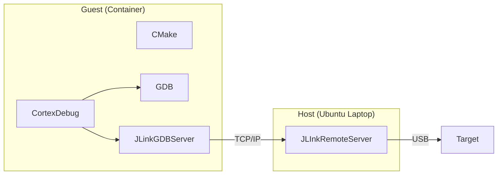

# Table of Contents
1. [Build this docker image](#building)
2. [Run container instance](#running)
3. [Github Docker registry](#registry)
4. [Development environment](#development)
    1. [Command Line](#manual)
    2. [CortexDebug](#vscode)
5. [X11 Server](#x11)
6. [Useful Links](#links)

Example use can be found in [MIDIPresetController](https://github.com/cracked-machine/MIDIPresetController) project.


## 1. Build this docker image <a name="building"></a>

Dockerfiles are available for the following dev environments:

- ARM Cross Toolchain: GCC 10.3.1 arm-none-eabi
- ARM Cross Toolchain: GCC 11.3 arm-none-eabi

Use VSCode [tasks](.vscode/tasks.json) to build the images locally. 

## 2. Run container instance <a name="running"></a>

docker run --rm -it stm32_dev

Recommended to use VSCode with `Dev Containers` installed. 

See example [devcontainer.json](examples/devcontainer.json) file.

## 3. Github Docker registry <a name="registry"></a>

To pull the pre-built image/push a new image you must authenticate to the [github registry](https://docs.github.com/en/packages/working-with-a-github-packages-registry/working-with-the-container-registry#authenticating-to-the-container-registry) by creating a `Personal Access Token` and __exporting it to a variable in your environment__. Recommend putting it in ~/.bashrc.

Pull the image using the [docker command](https://docs.github.com/en/packages/working-with-a-github-packages-registry/working-with-the-container-registry#pulling-container-images).

For example:

```
docker push ghcr.io/<USER>/stm32_dev:10.3-2021.10
docker pull ghcr.io/<USER>/stm32_dev:10.3-2021.10
```

## 4. Development environment <a name="development"></a>

This container provides a consistent development environment independent of the host machine. 

All that is requred on the host machine is 
- `SEGGER J-Link Remote Server V7.58` 
- Ability to run docker containers
- VSCode (Optional but recommeneded)

Below is an overview of the communication between the guest/host/target.



The only manual step is start the JLinkRemoteServer on the host

```
JLinkRemoteServer --select USB -Port 9999
```

If you change  this port, be sure to change it in the [launch.json](examples/launch.json) settings so the `CortexDebug` extension knows how to connect to `JLinkRemoteServer`.

---

Below two common workflows are outlined: `Manual` and `VSCode`.

### Command line <a name="manual"></a>
1. Connect your JLink to the target and power on the target. 
2. Connect your JLink to the USB port of the host.
3. Start the JLinkRemoteServer:

    ```
    JLinkRemoteServer --select USB -Port 9999
    ```
4. From the docker guest terminal connect to the JLinkRemoteServer. 

    Note: `<HOST>` is the localhost IP address of the host OS.
    - Manual
        
        - GDBServer
            ```
            JLinkGDBServer -if swd -device <device> -select ip=<HOST>:9999 -port <GDBSERVER_PORT>
            ```
        - GDB 
            ```
            arm-none-eabi-gdb <elf>  -ex 'target remote localhost:<GDBSERVER_PORT>'
            ```
### CortexDebug <a name="vscode"></a>
1. Connect your JLink to the target and power on the target. 
2. Connect your JLink to the USB port of the host.
3. Start the JLinkRemoteServer:

    ```
    JLinkRemoteServer --select USB -Port 9999
    ```

4. Update launch.json

    ```
    "servertype": "jlink",
    "ipAddress": "<HOST>:9999",
    ```
    See example [launch.json](examples/launch.json)

5. Press F5 to start debug in VSCode

## 5. X11 Server <a name="x11"></a>

Using JLink tools requires X11 Server installed on the host 

- `Linux` - should be already installed.
    
    Don't forget to run the xhost command (put it in ~/.bashrc on the host)

    ```
    xhost +
    ```
- `MacOS` - Install [XQuartz](https://www.xquartz.org/).
    
    - See instructions here - https://gist.github.com/sorny/969fe55d85c9b0035b0109a31cbcb088
    - Change the `DISPLAY` option in [devcontainer.json](examples/devcontainer.json) to `host.docker.internal:0`

- `Windows` - Install [VcXserv](https://sourceforge.net/projects/vcxsrv/).

    - Select the option to `disable access control`.
    - Change the `DISPLAY` option in [devcontainer.json](examples/devcontainer.json) to `host.docker.internal:0`


## 6. Useful Links <a name="links"></a>

- [https://github.com/Marus/cortex-debug/blob/master/debug_attributes.md](https://github.com/Marus/cortex-debug/blob/master/debug_attributes.md)
- [https://wiki.segger.com/J-Link_Remote_Server](https://wiki.segger.com/J-Link_Remote_Server)
- [https://wiki.segger.com/J-Link_GDB_Server](https://wiki.segger.com/J-Link_GDB_Server)
- [https://linux.die.net/man/1/gdb](https://linux.die.net/man/1/gdb)
- [https://docs.docker.com/engine/reference/run/](https://docs.docker.com/engine/reference/run/)
